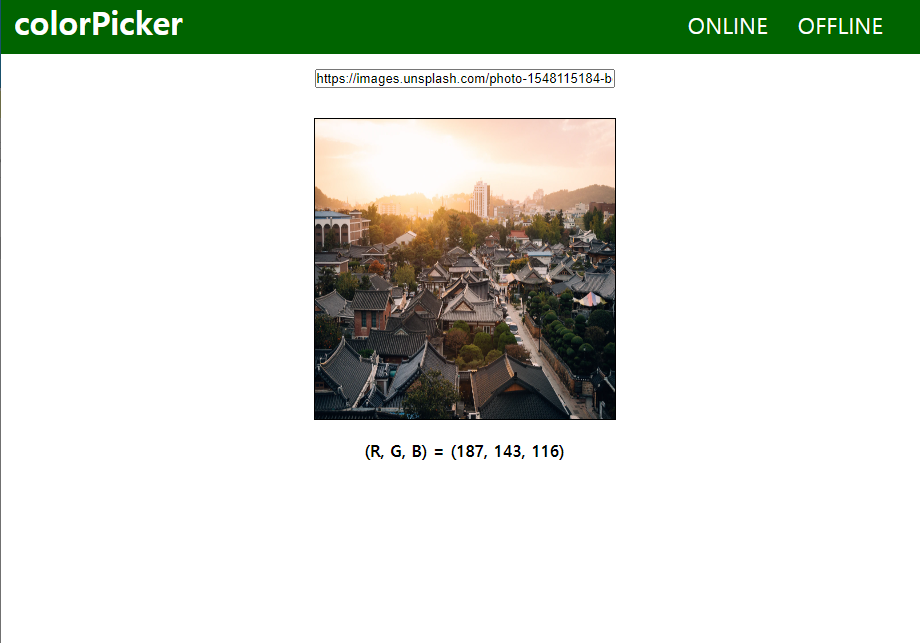

# colorPicker
very simple colorPicker to get RGB value from a photo in local or online using vanilla.js

## Website
https://arclic.github.io/colorPicker

## Spec
* HTML5
* CSS3
* Vanilla.js

## Screenshots

## Description
use `<canvas>` element in HTML5 and getImageData method
